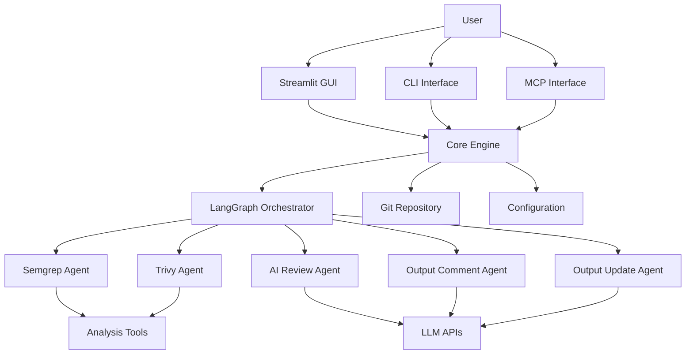

# System Architecture

## Architectural Style
- **Primary Pattern**: Multi-Agent Modular Architecture with Plugin-based Interfaces
- **Agent Orchestration**: LangGraph state machine for workflow coordination
- **Interface Pattern**: Adapter pattern for multiple interfaces (GUI/CLI/MCP)

## Core Architecture Diagram

## Key Components
- **Core Engine**: Central orchestration layer managing agent workflows and state
- **LangGraph Orchestrator**: State machine coordinating multi-agent execution flows
- **Semgrep Agent**: Static analysis agent for code quality and security pattern detection
- **Trivy Agent**: Security vulnerability scanning agent for dependencies and containers
- **AI Review Agent**: LLM-powered code analysis agent for intelligent suggestions
- **Output Comment Agent**: Generates explanatory comments for identified issues
- **Output Update Agent**: Automatically applies code fixes and improvements
- **Interface Adapters**: Abstraction layer supporting GUI, CLI, and MCP protocols
- **Git Integration**: Repository management and file selection capabilities
- **Configuration Manager**: User preferences, agent settings, and workflow configuration

## Architecture Notes
- **Monolithic**: All components are part of a single deployment unit. Communication is via in-process calls.
